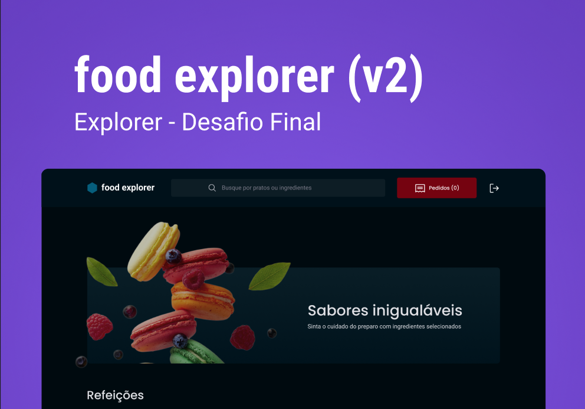

<h1 align="center"> Food explorer - Front-End</h1>

<p align="center">
  Cardápio digital para um restaurante fictício.
</p>

<p align="center">
  <a href="#-tecnologias">Tecnologias</a>&nbsp;&nbsp;&nbsp;|&nbsp;&nbsp;&nbsp;
  <a href="#-projeto">Projeto</a>&nbsp;&nbsp;&nbsp;|&nbsp;&nbsp;&nbsp;
  <a href="#-layout">Layout</a>&nbsp;&nbsp;&nbsp;|&nbsp;&nbsp;&nbsp;
  <a href="#memo-licença">Licença</a>
</p>

<p align="center">
  
</p>

<br>

<p align="center">
  
</p>

## 🚀 Tecnologias

Esse projeto foi desenvolvido com as seguintes tecnologias:

- HTML e CSS
- JavaScript
- Node.js
- React.js

## 💻 Projeto

Food Explorer oferece duas personas: Admin e Usuário.

### Admin:

- Controle total do cardápio.
- Criar, visualizar, editar e excluir pratos.
- Pratos com imagem, nome, categoria, descrição, ingredientes e preço.
- Adição de pratos gera mensagem de sucesso e redirecionamento.

<h3 style="color: #FF1B1C">Atenção
</h3>

O projeto pode apresentar problemas no banner na visualização pelo Netlify

### Usuário:

- Visualização completa do cardápio.
- Clique no nome do prato para detalhes específicos.
- Experiência intuitiva e informativa.

## 💻 Instalação

Para iniciar o projeto na sua máquina você deverá executar:

```bash
  $ npm install
  $ npm run dev
```

Além disso você deverá abrir o `/src/services/api.js` e alterar o `baseUrl` para `http://localhost:8080`. <br>
O que você acabou de fazer é definir o local onde o seu servidor está rodando

Depois disso abra a seguinte URL no seu navegador

```bash
  http://localhost:5173/
```

## 🔖 Layout

Você pode visualizar o layout do projeto através [DESSE LINK](<https://www.figma.com/file/C03SkcGvmm94VxYOxbXbsx/food-explorer-v2-(Community)?type=design&node-id=201-1532&mode=design&t=FIbwMVHSZLJYQ4gk-0>). É necessário ter conta no [Figma](https://figma.com) para acessá-lo. <br>

Caso queira acessa-lo atráves da internet utilize [este link](https://nesdark.github.io/nlw-10-explorer/).

Caso queira acessar o back-end use [este link](https://github.com/nesdark/food-explorer-back).

## :memo: Licença

Esse projeto está sob a licença MIT.

---

Feito com ♥ by Christian :wave:
